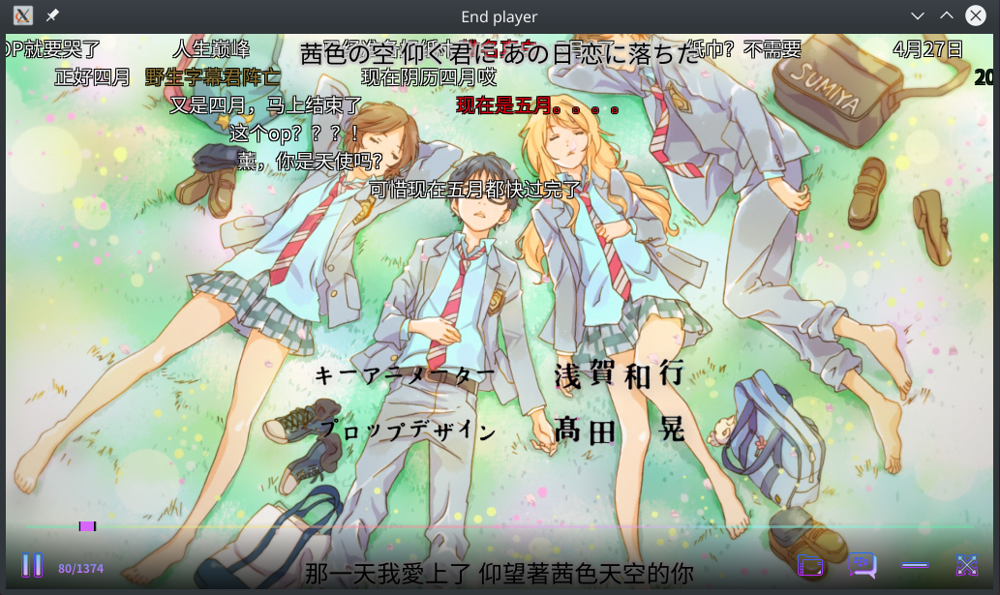

Endplayer
=====

> Electron N Danmaku Player



> Use Electron, React, mpv, danmaku player

## Todo
- [ ] Plugin System
  - [ ] Plugin: Auto Search danmaku
  - [ ] Plugin: Bilibili danmaku
  - [ ] Plugin: DandanPlayer API
  - [ ] Plugin: Send Danmaku
- [ ] Play List
- [ ] Danmaku Filter

## Depends
- mpv

## Build
```
npm install

# For Linux
npm run use-system-ffmpeg

# Run
npm run start
```

## About Get bilibili Danmaku

```
https://comment.bilibili.com/ + (cid) + (.xml)
https://comment.bilibili.com/52175602.xml

Or

https://api.bilibili.com/x/v1/dm/list.so?oid= + (cid)
https://api.bilibili.com/x/v1/dm/list.so?oid=87404714
```

## Acknowledgement
- [Kagami/mpv.js](https://github.com/Kagami/mpv.js)
- [weizhenye/Danmaku](https://github.com/weizhenye/Danmaku)

